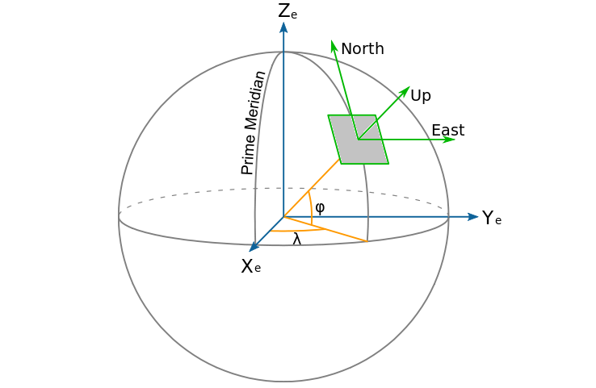

# Coordinate Systems, Attitude and Navigation Parameters

This document describes the coordinate systems, attitude parameters, and navigation
conventions used by the generator. Any new functionality based on different coordinate
systems, attitude parameters, or navigation conventions must convert its input data to
the project format before the generator processes it.

---
## Notation and Abbreviations

| Notation    | Description                                                                                                  |
|-------------|--------------------------------------------------------------------------------------------------------------|
| `ENU`       | *East, North, Up*. The navigation coordinate system (local-level frame).                                     |
| `nav`, `n`  | The ENU navigation coordinate system. `nav` is used in variable names; `n` is used in matrix notation.       |
| `body`, `b` | The coordinate system fixed to the object. `body` is used in variable names; `b` is used in matrix notation. |
| `DCM`       | *Direction Cosine Matrix*. Transforms vector components between coordinate systems.                          |
| `C_b^n`     | Transformation matrix from the body frame (`b`) to the local-level frame (`n`).                              |
| `ψ`         | Heading angle (`heading`), measured relative to north. In code: `heading_rad`.                               |
| `ϑ`         | Pitch angle (`pitch`). In code: `pitch_rad`.                                                                 |
| `γ`         | Roll angle (`roll`). In code: `roll_rad`.                                                                    |
| `rad`       | Radian.                                                                                                      |
| `m`         | Metre.                                                                                                       |
| `s`         | Second.                                                                                                      |

---
## Coordinate Systems

This section describes the three-dimensional coordinate systems used directly
when the generator processes input data.

### Geographic Coordinate System

The geographic coordinate system specifies the position of a point on the Earth's surface.
A position is defined by geographic latitude, longitude, and altitude.


```text
Latitude
Longitude
Altitude 
```

Latitude specifies a point's position relative to the equator and ranges from −90° to +90°.
Longitude specifies a point's position relative to the prime meridian and ranges from −180° to +180°.
Altitude is measured relative to the surface of the Earth model. A positive altitude denotes a point
above the ellipsoid surface; a negative altitude denotes a point below it.

### Navigation Coordinate System (local level frane)

The navigation coordinate system used by the project is ENU.
ENU (*East, North, Up*) is a three-dimensional coordinate system. Two axes point
towards the cardinal directions east and north; the third axis completes a right-handed
coordinate system.


```text
X_nav - East
Y_nav - North
Z_nav - Up
```

The `nav` suffix in variable names indicates that a vector is expressed in the ENU
navigation coordinate system.

### Axis Mappings

External input may use a different component order or sign convention. Before the
input reaches the mathematical core, represent that conversion with
`SignedAxisMapping`. The mapping defines each output component as a signed source
component and requires every source axis to be used exactly once.

`SignedAxisMapping.handedness` reports the sign of the mapping determinant. A
right-handed mapping preserves orientation; a left-handed mapping includes a
reflection. Call `validate_handedness()` when an integration requires a specific
orientation.

`InputConvention` applies explicit mappings at the input boundary. It converts
navigation vectors to ENU and converts `pitch`, `roll`, and `heading` to radians
and the canonical body/navigation frames. It expects the project's Euler sequence
for the input angles; another Euler sequence requires a separate conversion.

### Body Coordinate System (body frame)

The body coordinate system is a three-dimensional coordinate system rigidly attached
to the object. For an aircraft, the axes are defined as follows: the Y axis coincides
with the longitudinal axis of the aircraft, the X axis points along the right wing,
and the Z axis completes a right-handed coordinate system. The coordinate system is
orthogonal.


```text
X_body - right wing
Y_body - nose / forward
Z_body - Up
```

---
## Attitude Parameters

Attitude parameters describe the rotation of an object relative to a coordinate
system. Aircraft commonly use Euler–Krylov attitude angles. These are the three
angles known as roll, pitch, and yaw; hypercomplex numbers, or quaternions, may
also be used.

### Euler–Krylov Attitude Angles

The project uses roll, pitch, and yaw as attitude parameters.


```text
ψ - yaw
ϑ - pitch 
γ - roll
```

---
## Direction Cosine Matrix

A Direction Cosine Matrix (DCM) transforms vectors between the navigation and body
coordinate systems. The transformation matrix is obtained by applying successive
rotations through the angles ψ (yaw), ϑ (pitch), and γ (roll).

Rotation through the heading angle ψ:
$$
C_{\psi} = \begin{bmatrix} 
cos\psi & -\sin\psi & 0 \\
sin\psi & \cos\psi & 0 \\
0 & 0 & 1
\end{bmatrix}
$$

Rotation through the pitch angle ϑ:
$$
C_{\vartheta} = \begin{bmatrix}
1 & 0 & 0 \\
0 & \cos\vartheta & \sin\vartheta \\
0 & -\sin\vartheta & \cos\vartheta
\end{bmatrix}
$$

Rotation through the roll angle γ:
$$
C_{\gamma} = \begin{bmatrix}
cos\gamma & 0 & -\sin\gamma \\
0 & 1 & 0 \\
\sin\gamma & 0 & \cos\gamma
\end{bmatrix}
$$

The transformation matrix is formed by multiplying the elementary rotation matrices in sequence:
$$
C_n^b = C_{\gamma} \cdot C_{\vartheta} \cdot C_{\psi}
$$
- the lower index `b` denotes the body coordinate system (body frame);
- the upper index `n` denotes the ENU navigation coordinate system (local-level frame).

---
## Units of Measurement

| Quantity            | Unit    |
|---------------------|---------|
| Time                | `s`     |
| Latitude, longitude | `rad`   |
| Altitude            | `m`     |
| Velocity            | `m/s`   |
| Acceleration        | `m/s²`  |
| Angular rate        | `rad/s` |
| Attitude angles     | `rad`   |

If an external format uses degrees, feet, knots, or a different axis order,
the conversion must occur at the input/output boundary. The mathematical core
must not infer units.
---
