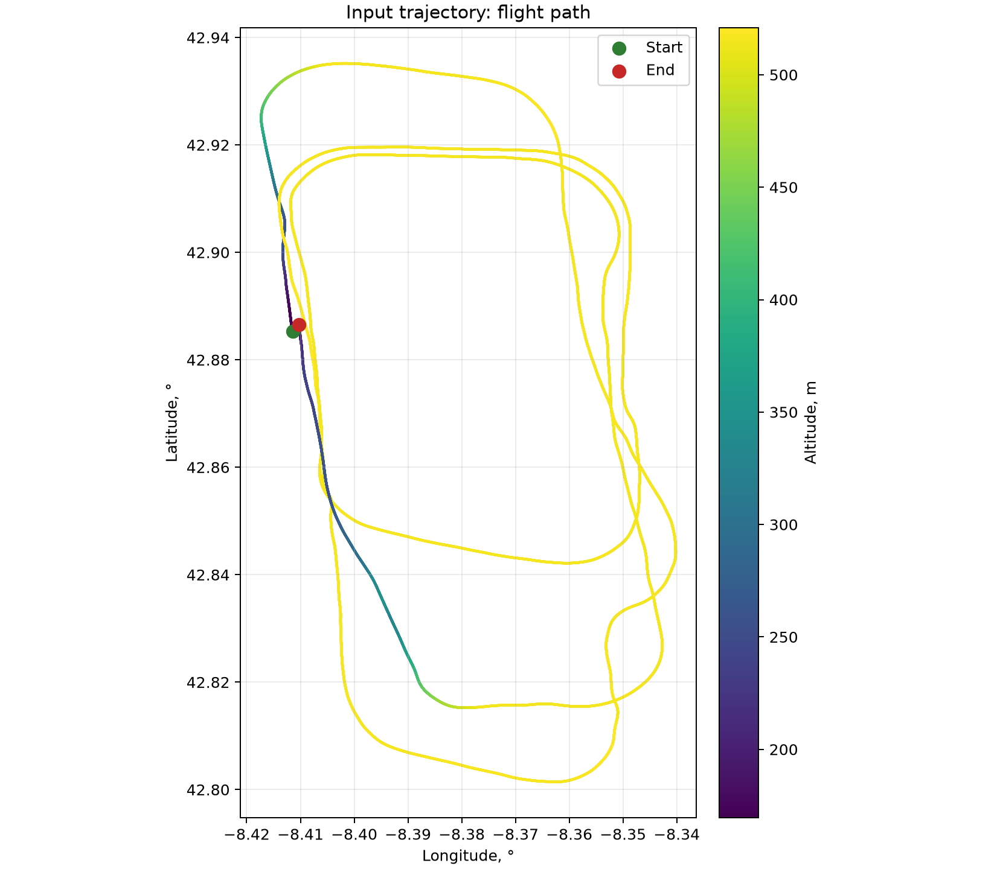
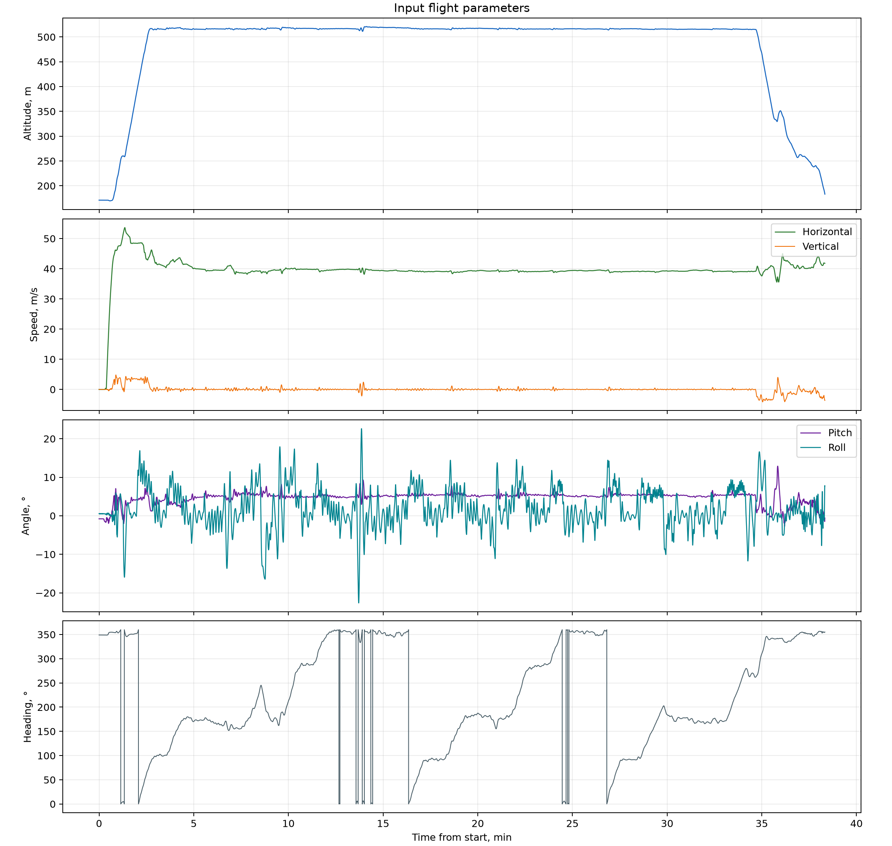

# IMU and GNSS Data Generation Example

This example contains a prepared flight trajectory and the corresponding
generated IMU and GNSS data. It is a runnable example and a regression fixture
for the generation algorithm.

Example directory structure:

```text
full_flight/
├── input/
│   └── prepared_trajectory.csv
├── preview/
│   ├── input-trajectory.png
│   └── input-motion-profile.png
├── reference/
│   ├── expected_gnss.dat
│   └── expected_imu.dat
└── generate.py
```

## Input trajectory

`input/prepared_trajectory.csv` contains 45,997 samples at 0.05 s intervals.
The recording lasts 2,299.8 s, or 38 min 19.8 s.



The plan view shows a route of about 90.85 km. The green point marks the start
of the flight and the red point marks the end. The line colour indicates altitude.



### Numerical characteristics of the trajectory

| Parameter        | Value                                                         |
|------------------|---------------------------------------------------------------|
| Altitude         | 169.6 to 521.0 m; 171.0 m at the start and 183.1 m at the end |
| Horizontal speed | Median 39.35 m/s (141.7 km/h); maximum 53.64 m/s (193.1 km/h) |
| Vertical speed   | −4.13 to 4.81 m/s                                             |
| Pitch            | −2.76° to 12.88°; median 5.16°                                |
| Roll             | −22.63° to 22.62°                                             |

## Input CSV format

| Column                                 | Unit | Meaning                                           |
|----------------------------------------|------|---------------------------------------------------|
| `t_meas_s`                             | s    | Time from the start of the recording              |
| `lat_deg`, `lon_deg`                   | °    | Geographic coordinates                            |
| `alt_m`                                | m    | Height above the ellipsoid                        |
| `pitch_rad`, `roll_rad`, `heading_rad` | rad  | Pitch, roll, and heading                          |
| `v_e_mps`, `v_n_mps`, `v_u_mps`        | m/s  | East, north, and vertical ENU velocity components |

`DcmTrajectoryReader` reads the file in chunks of 10,000 rows. Its
`time_step_s()` method makes a separate pass over the timestamps to calculate
the median step. Trajectory records are streamed, but this separate pass loads
all timestamps into memory.

## Generation

Run these commands from the repository root after
`uv sync --extra test --extra lint --frozen`.

Run the first 100 points:

```bash
uv run --no-sync python examples/full_flight/generate.py --points 100
```

Run the complete trajectory:

```bash
uv run --no-sync python examples/full_flight/generate.py
```

By default, `imu.dat` and `gps.dat` are written to
`examples/full_flight/output/`.

## Reference-data comparison

```bash
uv run --no-sync python examples/full_flight/generate.py --check
```

The command generates the complete data set and compares it with the files in
`reference/`. The CLI and regression tests use the same quantity-specific
tolerances in `generate.py`. A four-ULP comparison is not portable: `longdouble`
precision and the float64 SVD results differ between Windows and Linux.

With `eps = np.finfo(np.float64).eps`, the comparison uses:

- Time: relative and absolute tolerances of `4 * eps` (absolute in seconds).
- Specific force: relative tolerance `64 * eps` and absolute tolerance
  `64 * eps * 9.81` m/s², using gravity as the near-zero reference scale.
- Angular rate: relative tolerance `64 * eps` and absolute tolerance
  `rad2deg(2 * 12 * 32 * eps / dt)` °/s, about `1.95e-10` °/s at 20 Hz.
  This allows 32 epsilon of matrix round-off per iteration in each of two
  runs, across the 12-iteration limit, with the inverse step's `1/dt` scaling.
- GNSS position and velocity: relative and absolute tolerances of `8 * eps`
  in the corresponding DAT units. Flags must match exactly.

These are conservative regression allowances, not bounds on physical sensor
error or navigation accuracy. Non-finite values and shape changes fail the
check. On success, the command prints the maximum absolute difference across
all columns; this summary combines quantities with different units.

The reference files use the headers and units of `DatOutputFormat`.

`--check` compares output values; it does not verify iterative convergence.
Use `DcmTrajectoryGenerator.generate()` to inspect per-step diagnostics, as
described in the [API reference](../../docs/api-reference.md#dcmtrajectorygenerator).
